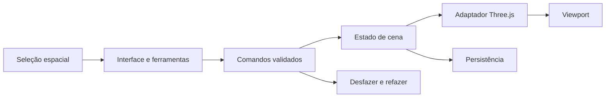

# Tabletop — investigação e proposta arquitetural

Data da análise: 3 de outubro de 2026.

Este documento entrega a investigação solicitada na Fase 1 e uma proposta concreta para orientar a Fase 2. Nenhum código do Tabletop foi implementado. Os dois projetos existentes foram examinados sem alterar seus arquivos versionados. As decisões abaixo são recomendações revisáveis; funcionalidades futuras e endpoints propostos estão identificados como tal.

**Recomendação principal:** criar uma aplicação web com JavaScript em módulos ES, Vite e Three.js, com editor orientado a documentos próprios e um servidor local Node.js/Express para guardar cenas e assets no computador do mestre. A ficha deve continuar responsável pelos dados dos personagens; o Jukebox, pela reprodução e edição musical. A integração precisa criar contratos explícitos entre esses sistemas.

## 1. Escopo e evidências

Foram examinados os arquivos de entrada, módulos, configurações, persistência, modelos de dados, chamadas HTTP e fluxos de edição dos dois projetos, incluindo:

- `Jukebox`: `index.html`, `player.js`, `song-state.mjs`, `scenes.js`, `upload-song.js`, `filters.js`, `settings.js`, todos os módulos de `mixing/`, `server.js`, README e estrutura do preset de exemplo.
- `Ficha teste - Ordem II`: `package.json`, lockfile, `src/app.js`, `src/dice3d.js`, estilos, `index.html`, `vite.config.js`, gerador de fichas padrão, workflow de deploy e estrutura do `sheets.json`.
- Fontes públicas oficiais sobre o tabletop de Ordem e documentação primária das tecnologias relevantes.

Não foram encontrados AGENTS.md aplicáveis nesses projetos. A pasta `Tabletop` já existia e estava vazia antes deste relatório.

Verificações executadas:

| Verificação | Resultado e alcance |
| --- | --- |
| Compilação da ficha com Vite instalado | Concluiu; saída isolada em `/tmp/tabletop-ficha-audit-dist`. Foi usado o `default-sheets.js` existente, sem executar o gerador nem substituir `dist/`. |
| Sintaxe do Jukebox | Os 17 arquivos `.js`/`.mjs` examinados passaram no parser do Node. |
| Backend do Jukebox | Inicializou em porta temporária; `GET /` e `GET /edit/audio/status` retornaram 200. |
| API de desenvolvimento da ficha | `GET /api/sheets` retornou 200, com oito fichas e IDs presentes. |
| CORS do Jukebox | `http://localhost:5500` foi aceito; `http://localhost:5173` retornou 500 sem cabeçalho de autorização de origem. |
| Estado dos repositórios | Ambos estavam sem alterações versionadas antes e após as verificações. |

Os servidores temporários foram encerrados. Não foram feitos downloads pelo yt-dlp, cortes de áudio, gravações de fichas ou testes de reprodução. Não havia executável de navegador disponível para uma validação visual automatizada; build e HTTP não demonstram desempenho gráfico ou qualidade de áudio.

## 2. Stack e arquitetura existentes

| Aspecto | Jukebox | Ficha teste - Ordem II |
| --- | --- | --- |
| Frontend | HTML/CSS e JavaScript nativo com módulos ES | HTML/CSS e JavaScript nativo com módulos ES |
| Framework de interface | Não encontrado | Não encontrado |
| Build | Não há configuração de bundler nem package.json neste checkout | Vite; `base: './'` |
| Backend | `server.js`, Node.js/CommonJS e Express | Middleware dentro de um plugin do servidor de desenvolvimento do Vite |
| Renderização | DOM e canvas para waveform | DOM/SVG/canvas; Three.js para dados 3D |
| Áudio/física | HTMLAudioElement, Web Audio, MediaRecorder, lamejs; FFmpeg/yt-dlp no servidor | Web Audio para efeitos da interface; cannon-es para física dos dados |
| Persistência | Arquivos de preset e localStorage; estado musical ativo em memória | `sheets.json` em desenvolvimento; IndexedDB/localStorage no navegador |
| Deploy identificado | README menciona frontend/backend separados e URLs Render no código | Workflow de GitHub Pages |
| Autenticação | Não encontrada no código analisado | Não encontrada no código analisado |
| Eventos entre aplicações | Não encontrados | Não encontrados |
| Multiplayer | Não encontrado | Não encontrado |

Na ficha, o package.json declara Vite `^7.1.7`; o lockfile resolve **7.3.6**. As outras versões resolvidas são **Three.js 0.186.0**, **cannon-es 0.20.0** e **html-to-image 1.11.13**. O Vite resolvido requer Node `^20.19.0 || >=22.12.0`; o ambiente examinado usa Node **22.22.2**. Isso permite manter a mesma família de ferramentas no Tabletop.

O Jukebox resolve Express **4.22.1**, cors **2.8.6** e yt-dlp-exec **1.0.2** a partir de `/home/ilvro/node_modules`, fora do checkout. Esses números descrevem o ambiente atual, não dependências fixadas pelo projeto. yt-dlp, ffmpeg e ffprobe estão disponíveis no sistema. A ausência de package.json/lockfile no Jukebox prejudica a reprodução da instalação em outra máquina.

### 2.1. Ficha: estado, interface e regras

O `src/app.js` concentra inicialização, estado, normalização, edição, persistência e construção da interface. A interface é produzida principalmente com templates HTML e `innerHTML`, seguido de ligação dos eventos em `bind()`. PV/PD também têm atualizações localizadas para evitar renderizar a página inteira a cada clique.

Existem três formas de apresentação: ficha tradicional, ficha cinematográfica e seleção/apresentação de agentes. O bloqueio de edição na apresentação é comportamento de interface, não uma permissão de usuário autenticado.

O módulo `dice3d.js` é carregado sob demanda e cria renderer WebGL, câmera em perspectiva, iluminação e simulação cannon-es. O exportador de imagem carrega html-to-image sob demanda. Isso confirma experiência concreta com Three.js no ecossistema, mas o módulo de dados está acoplado ao DOM da ficha e não é um motor de mapas reutilizável.

O objeto de ficha contém:

- `id`, nome, ocupação, perfil e nível;
- `pv`, `maxPv`, `pvTemp`, `pd`, `maxPd`, `pdTemp`;
- atributos Físico, Mente e Emoção, perícias e modificadores;
- cards de habilidades e itens, com IDs, marcadores, ações e fórmulas;
- história, imagem do personagem, fundo e preferências visuais.

`normalizeSheet()` e `normalizeCard()` já fazem adaptações de formatos antigos. Entretanto, não há uma versão explícita de documento, revisão de concorrência ou eventos de alteração por ficha.

Os oito registros atuais possuem IDs distintos. O normalizador gera IDs ausentes, e clonar uma ficha gera uma nova identidade. Importar um objeto que já tenha um ID presente também gera outro ID; a importação de arrays não aplica a mesma verificação. Portanto, o fluxo atual de importação não deve ser reutilizado automaticamente como restauração de um vínculo de token.

**Não existe um campo estruturado de condições no modelo atual.** Condições do Tabletop poderão ser locais inicialmente. Sua sincronização depende de adicionar um campo e uma política correspondente na ficha; não há como inferir condições a partir de descrições livres de cards.

Evidências: [modelo e normalização](</home/ilvro/Documents/Projects/Ficha teste - Ordem II/src/app.js:75>), [persistência](</home/ilvro/Documents/Projects/Ficha teste - Ordem II/src/app.js:770>), [clonagem](</home/ilvro/Documents/Projects/Ficha teste - Ordem II/src/app.js:951>), [dados 3D](</home/ilvro/Documents/Projects/Ficha teste - Ordem II/src/dice3d.js:183>).

### 2.2. Ficha: onde os dados realmente vivem

Na inicialização, a prioridade é:

1. `GET ./api/sheets`, se retornar um array não vazio;
2. IndexedDB `ordem-ii-db`, store `sheets-store`, chave `sheets`;
3. localStorage `ordem-ii-sheets-v1`;
4. fichas padrão importadas do módulo gerado `default-sheets.js`.

O salvamento envia **todas as fichas** por `POST /api/sheets`, além de gravar IndexedDB e localStorage. Alterações automáticas são agrupadas por um debounce de 300 ms. Se localStorage exceder a capacidade, o fallback remove imagens grandes de uma cópia reduzida.

O endpoint está em `configureServer()` do Vite. Seu POST faz parse do JSON e substitui o conteúdo de `sheets.json`. Não há validação de schema, limite explícito de corpo, escrita atômica, autenticação, revisão ou atualização por ID. O endpoint não faz parte do site compilado nem do servidor de preview como backend persistente.

O código de leitura usa caminho relativo; o de escrita usa caminho absoluto. Isso precisa ser padronizado ao hospedar a ficha sob um subdiretório. Na hospedagem estática, um POST sem endpoint pode falhar sem aviso: o código não examina `response.ok`, e as operações IndexedDB não são aguardadas para confirmar o toast de salvamento.

O `sheets.json` atual tem **9.970.423 bytes**, dos quais **9.903.280** são strings de imagem de personagem/fundo: aproximadamente **99,3%**. O build observado produziu um chunk principal de aproximadamente **10,09 MB**, ou **7,49 MB com gzip**. O gerador mantém as imagens, apesar de seu comentário inicial afirmar que as remove. O build embute as fichas padrão; isso não cria uma coleção compartilhada em tempo real.

Vídeos/GIFs carregados por `readMedia()` usam URLs `blob:` da sessão do navegador. Essas URLs não são arquivos persistentes nem referências portáveis para outra aplicação ou após reiniciar. Imagens estáticas são convertidas para data URLs WebP.

**Consequência para integração:** o navegador de um jogador pode ter uma versão diferente da ficha existente no computador do mestre. Um ID igual em duas cópias de um site estático não garante um registro central compartilhado. Será necessário escolher a coleção autoritativa e migrar os dados de cada origem de maneira explícita.

Evidências: [carregamento](</home/ilvro/Documents/Projects/Ficha teste - Ordem II/src/app.js:156>), [API de desenvolvimento](</home/ilvro/Documents/Projects/Ficha teste - Ordem II/vite.config.js:24>), [gerador](</home/ilvro/Documents/Projects/Ficha teste - Ordem II/scripts/gen-default-sheets.js:22>), [mídia](</home/ilvro/Documents/Projects/Ficha teste - Ordem II/src/app.js:558>), [deploy](</home/ilvro/Documents/Projects/Ficha teste - Ordem II/.github/workflows/deploy.yml:35>).

### 2.3. Jukebox: estado e reprodução

O frontend é servido como arquivos estáticos separados do servidor Express. O player usa elementos de áudio no navegador. O servidor não conhece quais faixas estão tocando.

`song-state.mjs` mantém um `Map` com registros por música: ID, ordem, status, volume, posição, marcadores, regiões, efeitos e atalhos. O registro também guarda objetos de runtime — áudio, arquivos e elementos DOM — que não podem ser enviados como um contrato JSON diretamente.

Os módulos de `mixing/` organizam efeitos em classes e um registry. Há loops, smooth loop, reverse, velocidade/pitch, reverb, echo, tremolo, filtros e presets. As regiões permitem parâmetros e ações por trecho. O caminho principal de mixagem compartilha um AudioContext e um barramento de volume final, com conexões individuais por música. Há contextos auxiliares para processamento de áudio.

`player.js` já exporta pontos úteis de reutilização:

- `playSong`, `stopSong`, `fadeIn`, `fadeOut`, `fadeTo`, `cutTo`;
- `configureSongForScene` e `getSongSceneSnapshot`;
- carregamento, remoção, reset e download de faixas.

Esses exports **não são APIs remotas**. Importar `player.js` diretamente no Tabletop executaria inicialização dependente de IDs e elementos do DOM do Jukebox. A reprodução, as ferramentas e parte dos parâmetros dos efeitos também estão ligados ao ciclo de vida da interface.

`filters.js` virtualiza a biblioteca para não montar todos os cards simultaneamente. O player limita processamento de waveform e evita decodificar indiscriminadamente músicas longas. Essas escolhas devem ser preservadas na integração.

Há eventos DOM como `songsUpdated` e `jukeboxPanelOpened`, mas eles se limitam à página atual. Não há BroadcastChannel, postMessage, WebSocket ou EventSource nos projetos examinados.

Evidências: [estado das faixas](/home/ilvro/Documents/Projects/Jukebox/song-state.mjs:1), [reprodução](/home/ilvro/Documents/Projects/Jukebox/player.js:3924), [snapshot sonoro](/home/ilvro/Documents/Projects/Jukebox/player.js:4019), [barramento de áudio](/home/ilvro/Documents/Projects/Jukebox/mixing/audio-context.js:1), [efeitos](/home/ilvro/Documents/Projects/Jukebox/mixing/effects-registry.js:27).

### 2.4. Jukebox: presets e cenas sonoras

Presets são pastas com `preset_metadata.json`, áudios e imagens. O salvamento usa `showDirectoryPicker()` e File System Access. Os metadados incluem título codificado, gêneros, tags, marcadores e atalhos/efeitos de atalhos. O fallback de leitura recebe arquivos selecionados pelo usuário; apesar do filtro oferecer `.zip`, não há descompactação de ZIP implementada nesse fluxo.

O preset não persiste um ID estável de biblioteca ou de música. Cada carregamento gera novos IDs de runtime. Também não é um snapshot completo de regiões, eventos de marcadores e parâmetros de efeitos.

O encoder lamejs é carregado de um CDN no `index.html`. Reproduzir arquivos locais e executar certas edições são fluxos diferentes: a edição que usa esse encoder pode precisar que o recurso já esteja disponível. Para operação presencial sem internet, essa dependência deve ser distribuída localmente na fase de integração, preservando a implementação existente.

As **cenas sonoras** são mais completas: `scenes.js` salva em `jukebox-scenes-v1` o volume mestre e as faixas ativas, incluindo volumes, posições, regiões e efeitos. Uma cena sem faixas representa silêncio. A ativação configura as faixas e usa as transições existentes.

As cenas sonoras têm IDs persistidos, mas a resolução de músicas tenta ID temporário, nome de arquivo, título original ou título editado. Dois presets com nomes iguais podem produzir associação ambígua. As cenas ficam no localStorage da origem, não no arquivo de preset; copiar uma pasta de preset não transporta automaticamente essas cenas.

`activateScene()` existe, mas não é exportada. Uma ponte deverá oferecer uma operação pública por ID, preservando a lógica existente e devolvendo o resultado de faixas ausentes.

Evidências: [gravação de preset](/home/ilvro/Documents/Projects/Jukebox/upload-song.js:589), [carregamento](/home/ilvro/Documents/Projects/Jukebox/upload-song.js:906), [geração de IDs](/home/ilvro/Documents/Projects/Jukebox/player.js:195), [resolução de cena](/home/ilvro/Documents/Projects/Jukebox/scenes.js:88), [ativação sonora](/home/ilvro/Documents/Projects/Jukebox/scenes.js:231).

### 2.5. APIs atuais e limitações de implantação

| Sistema | Endpoint existente | Função |
| --- | --- | --- |
| Ficha, apenas servidor de desenvolvimento | `GET /api/sheets` | Lê o arquivo inteiro. |
| Ficha, apenas servidor de desenvolvimento | `POST /api/sheets` | Substitui o arquivo inteiro. |
| Jukebox | `GET /` | Estado básico do servidor. |
| Jukebox | `GET /test-ytdlp` | Diagnóstico que acessa serviço externo. |
| Jukebox | `POST /download/youtube/audio` | Obtém e transmite áudio. |
| Jukebox | `POST /download/youtube/thumbnail` | Obtém thumbnail. |
| Jukebox | `GET /edit/audio/status` | Informa disponibilidade declarada e edição em andamento. |
| Jukebox | `POST /edit/audio/delete-region` | Corta região com FFmpeg, via corpo binário e cabeçalhos. |
| Jukebox | `GET /edit/audio/result/:filename` | Serve resultado temporário. |

Não existem endpoints atuais para listar fichas por ID com revisão, alterar PV individualmente, listar a biblioteca musical, iniciar reprodução ou ativar cena sonora remotamente.

O Jukebox usa `http://localhost:3000` em dois pontos do frontend. Em um celular conectado pela rede, localhost aponta para o celular. Em um frontend HTTPS, chamadas a HTTP também exigem uma estratégia adequada de hospedagem. O backend limita origens CORS a URLs específicas; CORS não constitui autenticação. Seu `listen()` não restringe explicitamente o endereço à interface de loopback.

Os resultados de edição ficam em diretório temporário do sistema. Não há rotina visível de expiração para resultados bem-sucedidos. O status de edição declara `available: true` sem testar FFmpeg naquele endpoint. A presença dos executáveis foi verificada, mas a cadeia de processamento não foi exercitada.

Essas limitações são relevantes para a futura operação compartilhada; não foram corrigidas nesta investigação.

## 3. Referência pública de Ordem Paranormal

Na [newsletter oficial de julho de 2025](https://ordemparanormal.com.br/newsletter/julho-2025), Cellbit confirmou o desenvolvimento de um tabletop interno, destinado a substituir o uso anterior do Tabletop Simulator e acompanhar mapas 3D. A [imagem publicada](https://ordemparanormal.com.br/wp-content/uploads/2025/07/image8.jpg) mostra miniaturas, pisos em alturas diferentes e uma árvore de controle de cena com paredes e andares, além de opções de visibilidade e iluminação. A imagem não revela a implementação dessas opções.

A [Jambô, em outubro de 2025](https://blog.jamboeditora.com.br/hexatombe-primeiras-impressoes-do-primeiro-episodio/), associou a ferramenta de Hexatombe a enquadramentos mais imersivos e à clareza das ações dos jogadores. Essa é evidência pública de objetivos de apresentação, não de arquitetura interna.

As fontes consultadas não estabelecem a engine atual, protocolo de rede, formato de mapas, API ou disponibilidade pública do programa interno. Relatos de comunidade e ferramentas citadas por artistas não foram usados para deduzir esses detalhes.

**Minha interpretação para o Tabletop:** combinar visão tática clara, controle de camadas/andares, miniaturas reconhecíveis e enquadramentos de cena; permitir que o mestre produza a apresentação sem depender de operação técnica durante a sessão. A estética desejada pode vir de composição, materiais, luz e assets, enquanto a edição permanece previsível.

## 4. Tecnologias recomendadas

| Escolha | Recomendação e justificativa |
| --- | --- |
| Interface | JavaScript ES modules, HTML e CSS. É a base dos dois projetos; dividir módulos e usar JSDoc/validação nos limites de dados. |
| Build | Vite com versões fixadas por lockfile, inicialmente alinhado à ficha. |
| Renderização | Three.js, inicialmente alinhado à versão 0.186.0 já presente, com WebGLRenderer. |
| Edição espacial | Raycaster, OrbitControls e TransformControls; transformar seus eventos em comandos do editor. |
| Servidor local | Node.js 22 compatível com o Vite atual e Express; API própria e estáticos de produção. |
| Persistência inicial | JSON por documento e arquivos de mídia separados no disco; IndexedDB para recuperação de rascunhos. |
| Rede futura | HTTP para documentos/assets; WebSocket para comandos/eventos de sessão quando houver dois dispositivos ou integração ao vivo. |
| Física | Movimentação explícita de tokens e seleção de superfícies. Usar física apenas se surgir uma interação que precise dela. |

Three.js já oferece [controle de câmera](https://threejs.org/docs/pages/OrbitControls.html), [transformação de objetos](https://threejs.org/docs/pages/TransformControls.html) e [carregamento de glTF](https://threejs.org/docs/pages/GLTFLoader.html). Esses recursos reduzem o código básico necessário, mas histórico, persistência, regras e permissões do editor continuam sendo responsabilidade do Tabletop.

O [WebGLRenderer atual requer WebGL 2](https://threejs.org/docs/pages/WebGLRenderer.html). A implementação precisa detectar suporte e mostrar um erro útil ao abrir a aplicação, em vez de uma tela vazia. A referência visual não deve ser convertida em promessa de desempenho antes de medir a máquina utilizada na mesa.

Uma engine completa, como Godot, é uma alternativa caso testes reais mostrem necessidades gráficas que justifiquem outro ambiente. Sua [exportação web](https://docs.godotengine.org/en/stable/tutorials/export/exporting_for_web.html) também depende de WebGL 2/WebAssembly e introduz um pipeline próprio. Para o escopo inicial e a integração com os dois frontends JavaScript, recomendo começar com Three.js.

React, TypeScript, um banco de dados e uma arquitetura ECS não foram encontrados como base desses projetos. Não são pré-requisitos para começar. TypeScript pode ser adotado no projeto novo se os contratos ficarem difíceis de manter; SQLite pode substituir o armazenamento quando consultas ou volume justificarem. A divisão proposta permite avaliar isso posteriormente.

## 5. Estrutura de diretórios proposta

Esta árvore é uma proposta; nenhum desses módulos foi criado.

```text
Tabletop/
  docs/
  src/
    main.js
    app/                    # Inicialização e composição da aplicação
    domain/                 # Dados e operações sem DOM ou Three.js
      documents.js
      validation.js
      migrations.js
      coordinates.js
    state/
      scene-store.js
      commands.js
      history.js
    editor/
      tools/                # Selecionar, colocar, mover, girar, terreno
      selection.js
    render/
      renderer.js
      scene-view.js
      camera.js
      picking.js
      asset-cache.js
    ui/                     # Toolbar, biblioteca, inspector, diálogos
    data/                   # HTTP e recuperação de rascunhos
    integrations/           # Adaptadores reais, adicionados na Fase 5
  server/
    index.js
    routes/                 # Documentos e assets
    storage/                # Escrita, revisões, backup e validação
  public/                   # Apenas recursos distribuídos com a aplicação
  tests/                    # Comandos, persistência e fluxos essenciais
  package.json
  vite.config.js

Diretório de dados configurável, fora do bundle e ignorado pelo Git:
  maps/
  scenes/
  assets/
  backups/
```

Cada pasta só deve ganhar módulos quando houver comportamento correspondente. Não é necessário criar antecipadamente plugins, serviços genéricos ou todos os tipos futuros de ferramenta.

O Vite deve encaminhar a API ao servidor local em desenvolvimento. Em produção local, o Express serve frontend compilado e API na mesma origem. A rota de API precisa ser registrada antes do fallback de HTML, para que uma URL de API inexistente devolva erro de API.

## 6. Separação entre estado, editor e renderização

O documento persistido deve conter dados serializáveis: IDs, números, strings, arrays e objetos simples. Meshes, materiais, texturas, elementos HTML e conexões de áudio pertencem ao runtime.



Exemplo: arrastar um token produz uma posição provisória no viewport. Ao concluir o gesto, um comando `token.move` valida e aplica a posição ao estado. O renderer atualiza a miniatura; o histórico guarda a posição anterior; o salvamento recebe o documento atualizado. Um movimento completo representa uma entrada de histórico, não centenas de entradas por evento de ponteiro.

Essa separação resolve três necessidades reais: desfazer, salvar/carregar com fidelidade e receber movimentos de outra tela. Não requer um framework de estado. O renderer pode manter um `Map<entityId, Object3D>` e atualizar somente entidades alteradas.

Seleção, ferramenta ativa, hover e posição provisória de arraste são estado da interface. Não devem ser gravados como estado de jogo. Comandos de integração também não devem disparar por render, autosave ou undo de uma propriedade visual: ativar uma cena sonora deve ser uma ação explícita de sessão.

## 7. Modelo de dados proposto

| Documento/entidade | Responsabilidade |
| --- | --- |
| `MapDocument` | Mapa reutilizável: grid, superfícies, objetos estruturais/decorativos, luzes e configuração inicial. |
| `SceneDocument` | Cena utilizável na sessão: cópia independente do layout, personagens, tokens, estado da sessão, câmeras e vínculo sonoro. |
| `Actor` | Identidade do personagem, NPC ou monstro; dados locais ou referência à ficha. |
| `Token` | Instância espacial de um Actor, com posição, rotação, escala visual, footprint e visibilidade. |
| `AssetRecord` | Referência persistente a imagem/modelo/textura e seus metadados. |
| `CameraPreset` | Enquadramento salvo; não equivale à câmera pessoal de cada cliente. |

Todo documento persistido recebe `schemaVersion`, `id` e `revision`. A versão indica o formato; a revisão controla alterações concorrentes. São conceitos diferentes. IDs novos podem usar UUID, preservando IDs existentes das fichas em suas referências.

### 7.1. Mapas e cenas

`MapDocument` deve guardar um `layout` composto por:

- grid e limites;
- superfícies de terreno/chão;
- entidades com `id`, `kind`, transform e propriedades do seu tipo;
- grupos/camadas com visibilidade e bloqueio de edição;
- iluminação e ambiente.

No MVP, uma superfície plana e objetos simples são suficientes. O campo `kind` permite acrescentar pisos elevados, plataformas, paredes, portas, áreas e props quando suas ferramentas forem implementadas. Geometria editável deve ser reconstruída de parâmetros; um mesh importado não substitui essas informações.

Ao criar uma cena a partir de um mapa, o layout é copiado para a cena. Uma referência `sourceMap: { id, revision }` registra a origem, sem tornar o mapa compartilhado um arquivo que todas as cenas alteram automaticamente. Isso permite mudar o cenário durante uma sessão e reutilizar o mapa original depois.

Duplicar um mapa ou uma cena cria novas identidades de documento e das entidades locais, remapeando referências internas. Referências a assets e fichas são preservadas. Copiar uma cena não deve duplicar uma ficha de jogador por acidente.

Estados transitórios, como uma porta aberta na sessão, podem ser adicionados depois por entidade. O modelo deve diferenciar a configuração inicial do mapa do estado da sessão. Não é necessário implementar portas ou um sistema completo de overrides no MVP.

### 7.2. Tokens e personagens

Um Token deverá conter, conforme a função for implementada:

- `id`, `actorId` e opcionalmente um override visual;
- transform: posição, quaternion de rotação e escala;
- footprint físico, distinto do tamanho da imagem/modelo;
- superfície/andar de apoio;
- visibilidade para participantes e bloqueio de edição.

O Actor guarda nome, imagem/modelo, propriedades customizadas e condições locais. Para atores sem ficha, guarda também os recursos próprios. Para atores vinculados, guarda `sheetRef: { provider, collectionId, sheetId }` e uma projeção de leitura da última revisão recebida. Os PV/PD dessa projeção são cache da ficha, não uma segunda autoridade.

Separar Actor e Token é útil já na integração: dois tokens que representem o mesmo personagem compartilham recursos, mas mantêm posições distintas. Nome/aparência podem ter overrides do mestre sem renomear a ficha. Não é necessário construir uma biblioteca global de atores antes de existir uso para ela.

### 7.3. Coordenadas, grid e alturas

Recomendo coordenadas de mundo com **Y para cima**, plano de mesa **XZ**, distâncias em **metros** e rotações internas compatíveis com quaternion. A interface mostra ângulos em graus. Essa convenção corresponde ao formato de entrega de assets escolhido; [glTF define unidades métricas e eixo vertical Y](https://registry.khronos.org/glTF/specs/2.0/glTF-2.0.html).

O grid deve ser configuração do mapa: tipo, origem, tamanho da célula, cor, opacidade e snapping. Inicialmente quadrado, com célula inicial de 1 m como configuração editável, sem presumir uma regra oficial de deslocamento. Guardar posições em metros evita converter todas as entidades quando o mestre altera o grid.

Tokens encaixam pela base e footprint; objetos podem encaixar por pivot. Centro de célula, canto de parede e centro de um token de duas células exigem offsets diferentes. O snap deve usar a origem configurada e funcionar com coordenadas negativas. O renderer não deve ser a única fonte dessas contas.

No início, o chão está em Y=0. Depois, superfícies com IDs próprios permitirão escolher piso e altura de apoio; clicar em um prédio com vários andares não deve mover o token silenciosamente ao telhado. Pintura de elevação pode evoluir para heightmap por área, enquanto prédios e pontes continuam representados por superfícies sobrepostas. Um único heightmap não descreve todos os andares de um edifício.

## 8. Renderização, câmera e UX

O ambiente deve ser 3D real com apresentação inicial inclinada, semelhante a uma mesa 2.5D. Recomendo câmera em perspectiva controlada pelo mestre, com orbit, pan, zoom, limites e comando para enquadrar a seleção. Uma vista superior/ortográfica pode ser acrescentada para edição precisa sem mudar os documentos.

O mouse da câmera deve ser configurado para não competir com seleção e arraste. Uma opção inicial é botão esquerdo para edição, botão direito para orbit e botão do meio para pan. Quando um manipulador estiver ativo, a câmera fica suspensa até terminar o gesto.

Tokens podem começar como discos ou recortes 2D em pé, com base e orientação legíveis, dentro da cena 3D. Isso permite usar imagens reais das fichas. Um modelo 3D passa pelo mesmo transform e Actor quando for suportado. É necessário distinguir o modo de recorte que acompanha a câmera do modo fixo no mundo.

Iluminação inicial: ambiente/hemisphere, uma luz direcional com sombras opcionais e materiais consistentes. Posteriormente: luzes pontuais, ambiente por cena e presets visuais. Luz desenhada no cenário não equivale a visão de jogador; esconder objetos pela escuridão também não equivale a um sistema de fog of war.

Para a sessão presencial, proponho dois modos de interface: **preparação**, com ferramentas e propriedades; e **sessão**, com controles reduzidos, tokens e câmeras. Uma janela de apresentação para TV pode reutilizar a projeção da cena, sem inspector nem ferramentas. A câmera dessa janela pode seguir um enquadramento publicado pelo mestre, sem obrigar a câmera do editor a segui-lo.

Ocultar paredes ou tetos para enxergar uma sala é uma opção de apresentação; revelar entidades secretas aos jogadores é uma permissão da sessão. Esses controles precisam de dados distintos.

Desempenho deve ser medido em conjunto com a música. Compartilhar geometrias/texturas, descarregar recursos ao trocar de cena, limitar sombras e pixel ratio e renderizar sob demanda quando possível são medidas iniciais. Instancing, LOD, compressão e pós-processamento devem responder a medições. A biblioteca de assets também pode usar a mesma ideia de virtualização já presente no Jukebox.

## 9. Assets e importação externa

Assets devem ser arquivos separados dos documentos, identificados por ID e, quando útil para deduplicação, hash. Um `AssetRecord` descreve tipo, caminho gerenciado, dimensões/bounds, tamanho, pivot, orientação e ajustes de importação. URLs `blob:` só existem no runtime; são recriadas a partir do arquivo/blob armazenado.

Formatos prioritários:

- imagens PNG/WebP/JPEG para tokens, texturas e mapas planos;
- GLB para modelos e cenas 3D;
- glTF com seus arquivos dependentes quando o importador souber coletá-los.

GLB facilita distribuir modelos com dados embutidos; o importador ainda deve verificar dependências e extensões. Um modelo pode vir com unidade, frente ou pivot inadequados: uma camada de normalização permite ajustar isso sem regravar a geometria original. O [GLTFLoader](https://threejs.org/docs/pages/GLTFLoader.html) suporta glTF 2.0 e diversas extensões, cuja compatibilidade deve ser conferida na versão efetivamente instalada.

Para um mapa 2D, a importação precisa de largura/altura físicas e calibração do grid. Para um cenário 3D, a geometria importada serve de conteúdo visual; paredes, portas e áreas jogáveis precisam de anotação semântica própria. Importar um prédio não significa obter portas funcionais automaticamente.

Arquivos de projeto `.blend`, pacotes de Unity ou formatos de outros VTTs não são promessas do importador inicial. Uma conversão externa para glTF/GLB é o caminho inicial. Importadores específicos podem vir depois sem alterar o formato principal de mapa.

Ao exportar, oferecer um pacote com manifesto, documento e assets necessários. O transporte pode começar por uma pasta/seleção de arquivos; ZIP depende de suporte implementado. Guardar apenas URLs externas torna a cena dependente de conectividade e do servidor de terceiros. Recursos locais do próprio aplicativo devem ser empacotados para uso presencial sem internet.

## 10. Persistência e futura sincronização

### 10.1. MVP no computador do mestre

Recomendo um servidor local pequeno, independente das APIs de desenvolvimento existentes. Ele guarda um JSON por mapa/cena e arquivos em diretório configurado. Listar, criar, carregar, salvar e duplicar documentos são operações explícitas.

A escrita deve validar o documento, conferir revisão, serializar gravações do mesmo arquivo e substituir por arquivo temporário/rename. Backups limitados permitem recuperação. O servidor deve confirmar sucesso somente após concluir a gravação; a interface distingue rascunho, salvando, salvo e erro.

IndexedDB guarda recuperação automática do trabalho em andamento, especialmente quando o servidor fica indisponível. Um rascunho mais novo não substitui silenciosamente o arquivo salvo: ao reabrir, o usuário escolhe restaurá-lo. Um frontend estático pode exportar/importar documentos, mas isso não deve ser apresentado como sincronização multiusuário.

**Rotas propostas, ainda inexistentes:** `/api/tabletop/maps`, `/api/tabletop/scenes` e `/api/tabletop/assets`, com IDs para leitura/gravação individual e operação de duplicação. Revisões podem ser transportadas por ETag/If-Match ou campo explícito, escolhendo um contrato consistente.

O modo inicial pode operar em loopback. Expor o servidor à rede durante a fase de sincronização exige distinguir mestre, jogador e tela de apresentação. Os controles de edição da UI atual não fornecem essa distinção.

### 10.2. Sessão em rede, posteriormente

Quando houver clientes em outras máquinas, recomendo um servidor de sessão autoritativo: recebe comandos, valida função do participante e revisão, atribui sequência e transmite alterações. HTTP distribui documentos/assets; WebSocket transmite comandos e eventos, sem áudio bruto ou imagens base64 a cada movimento.

Na conexão, o cliente recebe snapshot; depois, eventos incrementais. Na reconexão, recebe eventos desde a última sequência quando disponíveis ou um novo snapshot. Comandos recebem `commandId` para evitar repetição ao tentar novamente. Preview de arraste pode ser limitado em frequência; a posição final é uma alteração durável.

Clientes de jogadores recebem projeções filtradas. Dados de entidades ocultas, notas do mestre e assets secretos não podem ser enviados para depois apenas ocultar meshes. A janela local de TV não é, por si só, um modelo de autorização para dispositivos externos.

Não há necessidade atual de CRDT, colaboração de vários mestres, event sourcing persistente ou servidor de física. Um escritor autoritativo e comandos simples cobrem a primeira sessão sincronizada. Undo em uma sessão futura deve ser outro comando validado, sem apagar alterações legítimas de um jogador em uma ficha vinculada.

## 11. Integração correta com a ficha

### 11.1. Autoridade e fronteira

A ficha deve continuar dona de nome canônico, perfil, atributos, perícias, cards e PV/PD. O Tabletop é dono da posição, orientação, footprint, aparência substituta e estado do mapa.

O vínculo usa uma referência estável à **coleção + ID da ficha**, não o nome ou a posição num array. Recursos de um personagem vinculado só são alterados pelo serviço da ficha. O token atualiza sua projeção quando recebe a revisão confirmada.

Não recomendo acessar diretamente o IndexedDB da ficha nem usar GET + POST do array inteiro como sincronização. Diferentes portas/origens têm armazenamento distinto; mesmo um host comum não permite descobrir os dados do navegador de outra pessoa. Além disso, um POST baseado em snapshot antigo pode apagar alterações de cards ou de outra ficha.

### 11.2. Evolução necessária na Fase 5

1. Separar normalização e operações relevantes da ficha em módulos de domínio sem DOM, preservando formato e comportamento existentes.
2. Introduzir um repositório de fichas usado por seu frontend, com modo local atual e modo compartilhado explicitamente selecionado.
3. Criar uma API de produção da ficha no computador do mestre, reaproveitando esse domínio e uma única rotina de persistência.
4. Migrar/associar fichas da coleção escolhida, preservando IDs e registrando o namespace da coleção. Dados locais de jogadores precisam de exportação/migração explícita.
5. Conectar frontend da ficha e Tabletop à mesma autoridade quando a sessão compartilhada estiver ativa.

**Contrato proposto, não existente:** listar resumos, ler ficha por ID/revisão e alterar campos permitidos de recursos por comando ou PATCH. Um exemplo de comando transporta `commandId`, `sheetId`, revisão esperada e alteração de PV; a resposta traz os recursos confirmados e a nova revisão. Eventos `sheet.updated` propagam a alteração aos clientes interessados.

Um exemplo concreto: o mestre reduz PV no token; o serviço da ficha confirma a operação e publica a revisão; a ficha do jogador e todos os tokens vinculados mostram o mesmo valor. Se o jogador tiver alterado a ficha antes, o serviço ordena a operação ou devolve conflito para atualização explícita. Não se reenvia o personagem inteiro para ajustar um recurso.

PV temporário, limites e alterações de máximo precisam passar pelas mesmas operações de domínio. A política de aplicar dano primeiro a PV temporário não está demonstrada no código; deve ser definida antes de criar automações de dano. O primeiro contrato pode expor apenas ajustes explícitos dos recursos já existentes.

O middleware legado que sobrescreve `sheets.json` não pode continuar como escritor paralelo da coleção compartilhada. Todos os escritores ativos precisam usar o repositório autoritativo; o JSON antigo pode permanecer como importação/exportação compatível. Perder conexão não autoriza alterações divergentes de uma ficha vinculada sem sinalizar pendência.

Condições e propriedades customizadas podem permanecer locais até terem suporte correspondente na ficha. Excluir uma ficha deve marcar o vínculo como ausente e oferecer reassociação explícita, sem escolher outro personagem por nome.

## 12. Integração correta com o Jukebox

### 12.1. Reutilizar o runtime que já existe

O caminho inicial de menor mudança é manter uma **instância proprietária do Jukebox** aberta pelo mestre e adicionar uma ponte de comandos no próprio projeto. A ponte chama as funções existentes de reprodução, volume e cenas; devolve snapshots serializáveis, disponibilidade e falhas reais.

O Tabletop abre/conecta essa janela, recebe sua prontidão e apresenta um painel de música próprio para controle. O mestre carrega o preset e habilita áudio no Jukebox; daí em diante, play, pausa/stop, transições e troca de cena sonora são acessados pelo painel do Tabletop. O editor completo de áudio continua sendo o existente.

A primeira ponte pode usar [postMessage](https://developer.mozilla.org/en-US/docs/Web/API/Window/postMessage) entre janelas com referência conhecida, origem exata, verificação de remetente, allowlist de comandos e `requestId`. Isso funciona para origens distintas sem transformar o backend de processamento em player. Uma janela desconectada deve aparecer como indisponível, não como um botão que finge executar a ação.

O protocolo proposto oferece `getState`, `listScenes`, `activateScene`, `play`, `stop`, `fadeTo` e `setMasterVolume`. A implementação precisa devolver conclusão/falha de reprodução; algumas funções atuais retornam antes de terminar uma chamada assíncrona a `audio.play()`.

Não deve haver um segundo player no Tabletop. Incorporar uma nova instância enquanto uma anterior toca pode duplicar áudio e estado. Um painel incorporado completo pode ser avaliado depois, mas carregamento de arquivos e ativação de áudio precisam continuar atendendo às exigências do navegador. [showDirectoryPicker exige contexto seguro, suporte e interação do usuário](https://developer.mozilla.org/en-US/docs/Web/API/Window/showDirectoryPicker); não se deve presumir que um iframe de outra origem preserve todos esses fluxos.

### 12.2. Identidade de músicas e associação de cenas

Antes de persistir vínculos diretos de músicas, adicionar `libraryId` e `trackId` ao formato de preset, mantendo leitura dos arquivos antigos. O ID de runtime atual não é uma chave persistente. Durante migração, nomes podem sugerir uma associação, mas ambiguidades exigem escolher a faixa correta.

O Tabletop guarda uma referência de cue, por exemplo `provider`, biblioteca e ID de cena sonora. O Jukebox guarda o mix, regiões e efeitos. Abrir o mapa no editor não deve começar música automaticamente; ativar a cena na sessão pode acionar a cue conforme configuração do mestre.

Estados e retornos devem distinguir: biblioteca não carregada, cena inexistente, faixa ausente, áudio ainda bloqueado e comando concluído. A cena visual pode abrir mesmo se o Jukebox estiver desconectado, exibindo o estado real da integração.

Depois, se houver benefício comprovado, extrair uma fachada de controle e partes do player sem DOM permitirá um painel incorporado mais direto. Isso deve ser incremental, preservando efeitos e processamento existentes, não uma reimplementação musical.

### 12.3. Alcance das opções de comunicação

| Mecanismo | Uso recomendado | Limite |
| --- | --- | --- |
| Chamadas a módulos | Dentro de uma aplicação | Não controlam outro runtime automaticamente. |
| postMessage | Ponte inicial para janela proprietária do Jukebox | Exige referência ao contexto e verificação de origem/protocolo. |
| BroadcastChannel | Janela de edição e apresentação do próprio Tabletop, na mesma origem/partição | Não cobre portas distintas nem máquinas diferentes. |
| HTTP | Documentos, assets e API de fichas | Não substitui o runtime musical que toca no navegador. |
| WebSocket | Sessão LAN e ponte futura para runtimes registrados | É infraestrutura nova, a ser adicionada quando houver uso real. |

As limitações de origem e partição do [BroadcastChannel](https://developer.mozilla.org/en-US/docs/Web/API/Broadcast_Channel_API) tornam inadequado usá-lo como solução geral para os três endereços atuais. Hospedar os três frontends sob caminhos de uma mesma origem pode simplificar a experiência depois, mas não sincroniza dados antigos por si só e exige migração do armazenamento e revisão dos caminhos de API.

## 13. Fases e critérios de entrega

| Fase | Entrega recomendada | Critério para avançar |
| --- | --- | --- |
| 1 — Investigação | Este relatório, evidências e limitações | Comportamentos atuais e integrações possíveis identificados. |
| 2 — Arquitetura | Fixar contrato v1 de documento, comandos, diretórios e perfil de execução | Cenários de salvar, duplicar, recuperar e vincular têm semântica definida. |
| 3 — MVP | Cena vazia e biblioteca; terreno simples; grid; câmera; tokens reais; selecionar, mover, girar, editar propriedades, duplicar/remover; desfazer/refazer; salvar/carregar/exportar; recuperação | Preparar uma cena, fechar navegador/servidor, reabrir e continuar a sessão com os mesmos dados e assets. |
| 4 — Editor | Pisos/elevações, paredes, portas, obstáculos, props, áreas, grupos/andares, iluminação e importação GLB | Criar uma sala utilizável a partir do vazio e alterá-la sem perder o histórico/documento. |
| 5 — Integrações | Primeiro identidade/leitura e recursos da ficha; depois cue e controles reais do Jukebox; sincronização LAN conforme necessidade | Atualizações confirmadas nos dois clientes; música executada pelo Jukebox existente, com erros e desconexão visíveis. |

O MVP deve incluir terreno editável ao menos em dimensões/material e colocação livre de tokens, sem exigir mapas de demonstração. Discos ou recortes são representações finais válidas para esse estágio, não mocks de uma integração ausente.

Testes relevantes durante implementação: comandos e undo, snap negativo/multicélula, equivalência de save/load, referências de assets após reinício, falha de escrita/recuperação, duplicação sem corromper vínculos e fluxo completo no navegador. Na Fase 5: alterações simultâneas de PV, comando repetido, restauração de identidade, reconexão e duas bibliotecas musicais com títulos iguais.

Na implementação, a meta de desempenho deve ser definida com um mapa representativo e o Jukebox tocando na máquina da mesa. Ainda não existe benchmark que justifique prometer quantidade de tokens, tamanho de mapa ou FPS.

## 14. Riscos e decisões pendentes

| Risco observado ou previsto | Tratamento recomendado |
| --- | --- |
| Imagens embutidas inflando todos os salvamentos | Arquivos/blobs separados e referências persistentes. |
| Perda de alterações por sobrescrever todas as fichas | Serviço da ficha com escrita única, comandos por ID e revisão. |
| Dados dos jogadores em origens/navegadores diferentes | Migração explícita para coleção compartilhada; manter vínculo por coleção + ID. |
| IDs musicais temporários e associação por título | Identidades persistentes no preset e migração sem associação ambígua. |
| Acoplamento entre player e DOM | Ponte no runtime atual; extração gradual de fachada, conforme necessário. |
| Endpoints apenas de desenvolvimento ou localhost fixo | APIs de produção e configuração de endereço no modo de rede. |
| Ausência de autenticação ao expor sessão na LAN | Papéis e pareamento de sessão antes de permitir edição remota. |
| Assets externos grandes ou com orientação incompatível | Prévia de importação, normalização, limites e medição. |
| Telhados/paredes ocultando o jogo | Camadas de apresentação e seleção explícita de andar. |
| Edição de mapa interrompendo música | Processamento limitado e testes com os dois runtimes ativos. |
| Proposta virar uma engine genérica antes de ser utilizável | Implementar apenas contratos e ferramentas necessários à fase atual. |

Ainda precisam de validação na Fase 2: hardware e tamanho típico de mapa, navegador principal, uso de TV/segunda janela, formato dos primeiros assets reais e necessidade de dispositivos LAN já no primeiro piloto. A proposta inicial assume edição principal no computador do mestre e a ficha continua atendendo jogadores em seus próprios dispositivos. Essas escolhas não impedem a evolução, mas alteram prioridades de teste.

O próximo trabalho previsto é consolidar o contrato de documentos e os comandos do MVP. Este relatório não inicia a implementação nem altera a arquitetura dos projetos existentes.
