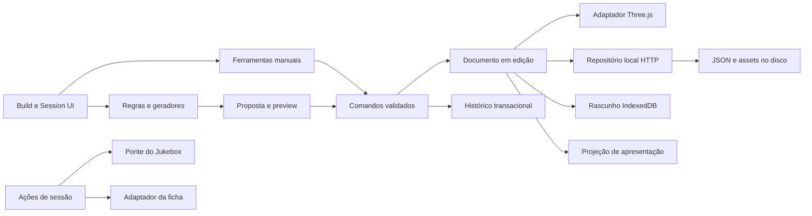

# Tabletop — arquitetura da Fase 2

Pesquisa inicial de 3 de outubro de 2026, atualizada em 4 de outubro. Arquitetura de referência com contratos entregues documentados e propostas futuras identificadas abaixo.

Este documento parte de [INVESTIGACAO_E_ARQUITETURA.md](../INVESTIGACAO_E_ARQUITETURA.md). A Fase 1 permanece como registro da investigação. As decisões de produto desta Fase 2 revisam seu escopo de MVP: piso, paredes, porta, iluminação, apresentação e assistência simples passam a fazer parte do primeiro vertical slice.

Os detalhes de autoria estão em [MAP_AUTHORING.md](MAP_AUTHORING.md), os de apresentação em [IMMERSION.md](IMMERSION.md), e entregas, critérios e pendências em [ROADMAP.md](ROADMAP.md). Os contratos abaixo são propostas, não APIs disponíveis.

## 1. Decisão central

Recomendo manter JavaScript com módulos ES, Vite, Three.js/WebGLRenderer e um servidor local Node.js/Express. O produto terá um único editor com ferramentas rápidas e controle manual, documentos serializáveis e uma projeção visual independente do estado persistido.

**Toda automação produz entidades comuns, com IDs, parâmetros e propriedades editáveis.** Quick Build, Assisted Build e Expert Build mudam o caminho até o resultado, mas usam os mesmos documentos, comandos, inspector e histórico. Prefabs e procedural não criam uma categoria de conteúdo bloqueado.

A composição passa a ter três responsabilidades:

| Conceito | Responsabilidade | Exemplo |
| --- | --- | --- |
| Mapa | Geometria, layout, superfícies, estruturas, props e organização espacial reutilizável. | Hospital, com corredores, portas e luminárias físicas. |
| Ambiente | Receita reutilizável de iluminação, aparência e efeitos. | Hospital à noite, frio, com névoa discreta. |
| Cena | Cópia do mapa, ambiente aplicado, atores/tokens, enquadramentos, estado da sessão e referência sonora. | Segundo andar durante um apagão, com uma porta aberta e personagens presentes. |

Essa separação permite variar a atmosfera sem duplicar o trabalho de geometria. Uma receita de ambiente não cria entulho nem desloca móveis ao ser ativada. Alterações físicas que tornam um hospital abandonado são ações explícitas do Smart Build, revisáveis no editor.

## 2. Perfil de execução e premissas

O usuário definiu um notebook intermediário com placa de vídeo e provável uso de projetor. O mestre pode controlar tudo; celulares conectados ao Wi-Fi local são uma possibilidade opcional.

- O MVP opera no computador do mestre, com servidor em loopback e janela local de apresentação para o projetor.
- O sistema operacional pode usar projeção estendida, permitindo editor no notebook e apresentação no projetor. Espelhamento também funciona, mas expõe a mesma interface; o Session Mode em tela cheia atende esse caso.
- A apresentação possui câmera e qualidade próprias. Não precisa mostrar seleção, gizmos, biblioteca ou notas do mestre.
- Clientes de celular/LAN ficam para uma etapa posterior. A arquitetura prevê projeções filtradas e comandos autorizados, sem tornar dispositivos de jogadores requisito para o primeiro piloto.
- Navegador, resolução do projetor, CPU/GPU/RAM e tamanho típico das cenas ainda precisam ser medidos. “Intermediário” orienta prioridades, não constitui um benchmark.

Build Mode e Session Mode são modos de interface. Papéis de mestre, jogador e apresentação pertencem à futura autorização de sessão; um botão escondido não estabelece permissão.

## 3. Reexame dos projetos existentes

Os pontos relevantes da Fase 1 foram conferidos diretamente no código, sem alterar os projetos nem repetir seus testes de build/HTTP. Ambos estavam sem alterações versionadas no início desta etapa. Não foram encontrados AGENTS.md aplicáveis.

| Evidência atual | Consequência arquitetural |
| --- | --- |
| A ficha usa JS/Vite; o lockfile resolve Three.js 0.186.0 e Vite 7.3.6. | Começar com essa família e fixar dependências no novo lockfile. Não criar o projeto nesta fase. [Package](<../../Ficha teste - Ordem II/package.json>), [lockfile](<../../Ficha teste - Ordem II/package-lock.json>). |
| Normalização, interface e recursos da ficha estão em `app.js`; a persistência envia todas as fichas. | Preservar a autoridade da ficha e evoluir seu domínio/repositório antes de escrita integrada por ID. [Modelo](<../../Ficha teste - Ordem II/src/app.js>), [API de desenvolvimento](<../../Ficha teste - Ordem II/vite.config.js>). |
| O player do Jukebox usa objetos de áudio e elementos DOM; o backend realiza download/edição. | A ponte deve executar comandos dentro do runtime musical existente. [Estado](../../Jukebox/song-state.mjs), [player](../../Jukebox/player.js), [servidor](../../Jukebox/server.js). |
| `activateScene()` é interna e `playSong()` não devolve a promessa de reprodução. | Expor uma fachada com resultados confirmados antes de apresentar controles remotos como concluídos. [Cenas](../../Jukebox/scenes.js). |
| Presets persistem títulos/tags, mas não `libraryId`/`trackId`; cenas sonoras usam localStorage. | Migrar identidades e transportar cenas explicitamente. Nome não é vínculo durável. [Presets](../../Jukebox/upload-song.js). |
| Jukebox usa um barramento Web Audio compartilhado e virtualização de biblioteca. | Preservar a implementação e medir concorrência de áudio, importação e renderização. [Áudio](../../Jukebox/mixing/audio-context.js), [biblioteca](../../Jukebox/filters.js). |

Os exports do Jukebox e o módulo de dados 3D da ficha não serão importados no editor como se fossem bibliotecas independentes de DOM. As limitações de armazenamento, CORS, localhost e implantação descritas na Fase 1 continuam relevantes.

## 4. Síntese das pesquisas e sua aplicação

As pesquisas independentes trataram de autoria, renderização/imersão e Smart Build, sem implementação. Sua síntese recomenda:

| Pilar | Conclusão para o Tabletop | Evidência e detalhamento |
| --- | --- | --- |
| Autoria | Ferramentas de desenho e transformação precisam de parâmetros semânticos, snapping configurável e escape para edição livre. | Referências oficiais de Blender/ProBuilder/TransformControls em [MAP_AUTHORING.md](MAP_AUTHORING.md). |
| Assistência | Gerar candidatos a partir de espaço, categorias, encaixes e circulação; mostrar alternativas antes de aplicar. | Trabalhos de layout assistido e metadados procedurais em [MAP_AUTHORING.md](MAP_AUTHORING.md). |
| Imersão | Investir primeiro em composição, materiais consistentes, iluminação legível e câmeras preparadas; adicionar efeitos conforme medição. | Documentação Three.js e estudo visual de Ordem em [IMMERSION.md](IMMERSION.md). |
| Reutilização | Copiar snapshots de mapa/ambiente para a cena e registrar a origem. Atualizações de biblioteca precisam de diff explícito. | Decisão própria, coerente com save/load, duplicação e liberdade manual. |
| Performance | Qualidade é local a cada viewport; medir projetor e editor juntos, com o Jukebox ativo. | Estratégia detalhada em [IMMERSION.md](IMMERSION.md). |

Não há evidência pública suficiente para deduzir o código, a engine ou o pipeline interno do tabletop de Ordem. A inspiração adotada é a experiência visual observável, documentada separadamente das hipóteses técnicas.

## 5. Componentes e fluxo



O domínio calcula coordenadas, valida estruturas, associa referências e aplica mudanças sem DOM ou Three.js. Os geradores recebem um snapshot e um catálogo de metadados; devolvem propostas, não meshes como documento final.

Presets pessoais de pincéis ficam fora dos documentos: `domain/brush-presets.js` captura e valida apenas ajustes reutilizáveis; `data/brush-presets.js` persiste uma biblioteca IndexedDB por endereço/caminho, com gravação transacional e comparação de revisão entre abas. `ui/brush-presets-panel.js` oferece os controles de terreno/rocha, integrados pelo editor. Aplicar configura a ferramenta conservando a camada atual, sem escrever no store, no histórico ou na apresentação. Uso e limites: [BRUSH_PRESETS.md](BRUSH_PRESETS.md).

A autoria de terreno materializa expansão/recorte e relevo rochoso em alturas/máscaras comuns, sem dados de gerador persistente. O campo de rocha usa posição mundial; proteção de pisos aplica um limite absoluto abaixo dos contornos sólidos, com margem de triângulo e transição idempotente. O preset de montanha e ajuste sob construções passam pela proposta validada, sem escrita antes de aceitar. Ver [MATERIALS.md](MATERIALS.md).

O kit de rochas usa rockShape opcional por prop para formação/irregularidade/detalhe/seed e saliências/camadas/erosão opcionais. O catálogo em cache conserva receitas; rock-geometry.js gera malhas próprias da instância, normalizadas aos bounds/base anotados e descartadas com ela. Modelos anteriores não são modificados. As formas novas de paredão/pináculo usam anéis de slab fechados, com tampas que preservam vértices colineares; entulho fixo não herda a forma editada. Receitas do kit agrupam por material/superfície/sombreamento e conservam metadados geométricos para diagnóstico. Cordas/argolas estáticas têm detalhe limitado em `mountain-primitives.js`. Uso/limites: [ASSET_LIBRARY.md](ASSET_LIBRARY.md) e [MOUNTAIN_KIT.md](MOUNTAIN_KIT.md).

O complemento orgânico acrescenta `organic`/`organic-cliff` sem modificar as formas antigas. `organic-rock.js` produz volumes fechados com deformação espacial em várias escalas e fraturas locais; duas novas receitas usam IDs próprios. `snowStyle: 'organic'` seleciona depósitos conectados em `snow-deposit.js`, com normais/espessura compartilhadas, exposição, bordas afinadas e campo de vento; ausência do campo preserva a cobertura anterior. O terreno usa o mesmo campo de espessura em `snow.js`, conservando concordância com os apoios. Precipitação animada é separada do depósito persistido; o emissor distingue neve/chuva descendentes de poeira/brasas ascendentes. Uso, campos e limites: [ORGANIC_WINTER.md](ORGANIC_WINTER.md).

O kit da igreja utiliza perfis sólidos extrudados (`profile`) em receitas locais, com contornos XY simples validados, UV/normais e agrupamento por material/superfície. Materiais de receita aceitam opacidade opcional; vidros translúcidos não projetam sombra opaca. Ausência conserva os materiais existentes. Props arquitetônicos não recortam paredes nem ganham apoio/cutaway estrutural implícito; [CHURCH_KIT.md](CHURCH_KIT.md) descreve montagem e limites.

O renderer mantém uma associação de ID para objetos Three.js, reconstrói geometrias paramétricas e atualiza entidades afetadas. Cache de bounds e índice espacial são dados derivados: podem ser reconstruídos, sem serem a única descrição do mapa.

Materiais e camadas do terreno persistem IDs de textura local e parâmetros opcionais de cor/desenho, com padrões que conservam documentos anteriores. `surface-pixels.js` gera tiles determinísticos e mantém cache CPU limitado; `surface-materials.js` compõe projeção em três eixos e parâmetros de cor/orientação no shader. Atlas personalizados são compartilhados por conjuntos de desenhos equivalentes e liberados por referência ao descarte do último material. Camadas do terreno podem persistir distribution por inclinação/altura, conservando as máscaras manuais; material.coverage acrescenta uma cobertura por slot, visual quando physicalThickness é zero e geométrica quando a neve possui espessura. O preset de montanha materializa alturas e camadas comuns, sem dependência viva de gerador. Uso e campos: [MATERIALS.md](MATERIALS.md).

`material.wear` acrescenta uma camada procedural opcional por instância/slot sobre mapas originais e superfícies, com distribuição em coordenadas locais do objeto. `domain/wear.js` define parâmetros validados; `render/material-wear.js` compõe o shader PBR sem atlas, malhas ou passes adicionais. Configurações seguem documentos, clipboard e projeção; ausência mantém a aparência anterior. Escopo e limites em [MATERIAL_WEAR.md](MATERIAL_WEAR.md). A evolução de atualização incremental, fontes/zonas reutilizáveis e orçamento de sombras é uma proposta futura em [DYNAMIC_LIGHTING_PLAN.md](DYNAMIC_LIGHTING_PLAN.md).

Seleção, hover, ferramenta, arraste provisório, preview de sugestão e câmera de trabalho pertencem à UI. Câmeras salvas, estado de porta e ambiente da cena pertencem ao documento. Conexões, loaders, texturas GPU e áudio pertencem ao runtime.

## 6. Contrato de documentos

### 6.1. Envelope e convenções

| Campo | Contrato proposto |
| --- | --- |
| `schemaVersion` | Inteiro `2` no contrato atual, com migração explícita de `1`. Andares/camadas e campos estruturais são opcionais; versões futuras incompatíveis não são sobrescritas. |
| `documentType` | `map`, `scene` ou `environment`. A biblioteca persistente de ambientes está implementada no schema 2; ver [ENVIRONMENTS.md](ENVIRONMENTS.md). |
| `id` | UUID estável do documento. Importar para restaurar preserva identidade; importar como cópia gera novos IDs locais. |
| `revision` | Inteiro não negativo atribuído pelo servidor; começa em 1 após criação. Não aumenta a cada movimento provisório. |
| `name` | Nome editável, sem função de identidade. |
| `createdAt`, `updatedAt` | Instantes UTC ISO 8601 atribuídos pelo servidor; exibidos no fuso local. |
| `layout` | Snapshot de grid, superfícies, estruturas, props e organização espacial. Presente em mapa e cena. |

Números devem ser finitos. Vetores são arrays de três números; quaternion é `[x,y,z,w]`, normalizado. Escalas são positivas; dimensões estruturais não podem ser nulas. IDs locais são únicos no documento e referências internas precisam existir.

Mundo em metros, Y para cima, plano XZ e rotações internas por quaternion. A convenção coincide com as [unidades e coordenadas de glTF](https://registry.khronos.org/glTF/specs/2.0/glTF-2.0.html). O inspector mostra graus e dimensões físicas, sem impor o grid à posição persistida.

No v1, `transform` descreve posição do pivot, quaternion e escala em coordenadas de mundo. O agrupamento usa referências organizacionais, sem pais transformáveis. A autoria atual mantém transforms mundiais e ancoragem estrutural explícita; hierarquia local exigirá migração deliberada; não reinterpretar silenciosamente transforms de mundo como locais. Portas hospedadas são a exceção: sua posição visual deriva da parede e dos parâmetros da abertura.

### 6.2. Layout e entidades

O contrato atual inclui pisos com `vertices`/`holes`, terreno por `segments`/`heights`, `flatShading` opcional e até oito `paintLayers` opcionais (cor/opacidade/visibilidade e máscara por vértice), paredes com `floorIds`, `layout.levels`/`layout.layers` e associações opcionais `levelId`/`layerId`. Escadas/rampas usam `fromLevelId`/`toLevelId`; props/luzes podem ter `anchor: {hostId, socket, offset}`. Transforms permanecem mundiais. Detalhes e limites: [STRUCTURAL_EVOLUTION.md](STRUCTURAL_EVOLUTION.md).

| Estrutura | Campos mínimos e semântica |
| --- | --- |
| `grid` | `type: square`, origem XZ, tamanho de célula em metros, cor/opacidade, visibilidade e snap padrão. Grid visual e snap podem ser desligados separadamente. |
| `entities` | Coleção por ID; `kind` diferencia `floor`, `wall`, `door`, `prop` e, na V2, `window`/outros tipos. |
| Entidade comum | ID, nome, kind, `groupId`, `surfaceId` quando apoiada, tags, `locked`, `audience: all ou gm`; transform para entidades de posição livre. |
| `floor` | Superfície retangular: largura, comprimento, espessura, material base. Pivot no centro da face superior; espessura cresce para baixo. O ID do piso identifica essa superfície de apoio. |
| `wall` | Segmento com comprimento, altura e espessura, em eixo local +X; pivot no início da base e no centro da espessura. Transform posiciona/orienta; aberturas referenciam essa entidade. |
| `door` | `wallId`, distância do centro da abertura ao início local da parede, largura, altura, soleira, lado da dobradiça e ângulo inicial. Seu transform visual é derivado da abertura e dobradiça; não existe posição independente conflitante. |
| `prop` | Referência de asset, transform livre, footprint e materiais base por slot. |
| `groups` | Coleções organizacionais com ID, nome e parentId opcional. Sem ciclos. Bloqueio e filtros de apresentação são propriedades distintas. |
| `areas` | Regiões de autoria identificadas por ID. No MVP: retângulo com transform, largura/comprimento, surfaceId e memberIds das estruturas associadas; não implica paredes indestrutíveis nem pathfinding. |

Quick Build mantém paredes próprias por sala; o gerador de contorno de V2 já reutiliza intervalos colineares compartilhados, com junções anguladas/T limitadas. As medidas de sala são internas. Pisos e paredes usam dimensões paramétricas como autoridade: escala estrutural é unitária e o gesto de escala altera essas dimensões, enquanto props/tokens mantêm escala no transform. As ferramentas iniciais tratam pisos horizontais e paredes verticais; orientações estruturais mais amplas exigem validação de apoio na evolução.

A geometria das aberturas é reconstruída a partir de parâmetros, usando partes de parede ao redor do vão. Uma porta visualmente sobreposta a uma parede intacta não satisfaz o contrato. A área ajuda seleção/assistência; mover uma parede individualmente não realinha todos os membros sem um comando de sala explícito. Uma área desatualizada precisa ser revisada antes de gerar sobre ela.

Duplicar sala remapeia pisos, paredes, portas, áreas e grupos juntos. Apagar ou diminuir parede com aberturas exige preview das dependências e uma transação coerente; não deixa portas órfãs. Mais detalhes em [MAP_AUTHORING.md](MAP_AUTHORING.md).

### 6.3. Mapa, ambiente aplicado e cena

O mapa contém o layout e `defaultLook`, um ponto de partida visual serializado. As luminárias como objetos pertencem ao layout; as fontes de luz que as fazem iluminar pertencem ao look. `defaultLook` não transforma atmosfera em geometria: serve apenas para iniciar uma cena ou visualizar o mapa em preparação.

Uma cena contém, além do envelope/layout:

| Campo | Função |
| --- | --- |
| `sourceMap` | `{id, revision}` opcional, como proveniência. O layout é uma cópia independente. |
| `sourceEnvironment` | Referência e versão do preset interno no MVP; referência `{id, revision}` para documentos de ambiente na V2. Nunca dependência viva. |
| `look` | Estado visual aplicado: fundo/ambiente, luzes com IDs, ajustes de materiais, fog, emissores de efeitos e pós-processamento solicitado quando suportado. |
| `actors`, `tokens` | Identidades e instâncias espaciais, separados. |
| `cameraPresets` | Enquadramentos salvos por ID, projeção, posição, alvo, FOV ou escala ortográfica e limites relevantes. |
| `sessionState` | Estados locais por entidade, como ângulo atual de porta. Valor ausente usa configuração inicial do layout. |
| `audioCue` | Referência opcional a uma cena sonora do Jukebox e política de acionamento explícita. O mix não é copiado. |

Carregar documento reconstrói seu estado salvo; não executa geradores, não aplica novamente ambiente e não toca música.

O MVP precisa de `look` com iluminação ambiente, direcional/pontual, cor e intensidade, sombras seletivas, fundo e ajustes simples de materiais. Fog, volume por altura, bloom, horário/exposição, céu/nuvens, clima e vínculos por horário possuem campos opcionais validados no schema 2; documentos anteriores preservam sua aparência. O v1 não aceita qualquer objeto arbitrário como promessa de extensibilidade; novas versões adicionam formatos validados.

Contrato visual vigente, com extensões opcionais do schema 2:

| Campo de `look` | Tipo e semântica |
| --- | --- |
| `background` | Cor sRGB quando o céu está desligado; céu procedural em `sky`. Environment map/reflexos permanece futuro. |
| `fill` | Tipo hemisphere, cores de céu/chão e intensidade não negativa. |
| `lights` | Coleção por ID com tipo `directional`, `point` ou `spot`, posição/quaternion, cor sRGB/Kelvin, intensidade, alcance, sombras e flicker opcional; spot inclui cone/penumbra. |
| `daylight`, `sky` | Horário/exposição, gradiente, sol/lua/estrelas e nuvens com controles/seed. |
| `weather` | Emissor global em região XZ/altura, tipo/quantidade/cor/velocidade/vento/seed; até 3.000 partículas por viewport. |
| `nightWindows`, `environmentBindings` | Regra global de vidros noturnos e vínculos por ID de prop/janela/luz, horário, slot e emissão; referências existentes e projeção filtrada. |
| `fog`, `volumetricFog`, `bloom`, `effectsPaused` | Névoa de distância/altura, halo e pausa dos efeitos; configurações opcionais validadas. |
| `materialAdjustments` | Ajustes por entityId e slot de material existente: cor, roughness/metalness em 0–1, emissive e intensidade não negativa, conforme suporte do material. |

O adaptador converte direção de luz em alvo Three.js. Resolução de sombra, pixel ratio e efeitos efetivos pertencem ao perfil local do viewport, sem alterar look. Materiais base pertencem às entidades; ajustes do look sobrepõem propriedades permitidas e mantêm o original.

Em `sessionState`, porta usa ângulo atual em radianos por entityId; valor ausente usa ângulo inicial. Presets de câmera usam posição/alvo em metros, projeção `perspective` com FOV vertical em graus ou `orthographic` com altura de enquadramento em metros. Near/far positivos e ordenados são configuração validada do adaptador; aspect ratio vem do viewport. Recarregar conserva o preset e resolve seu enquadramento para a tela atual.

### 6.4. EnvironmentDocument e aplicação na V2

**Contrato entregue em 4 de outubro de 2026:** envelope de schema 2 e `settings` com `background`, `fill`, `daylight`, `sky`, `weather`, `fog`, `volumetricFog`, `bloom`, `nightWindows`, `effectsPaused` e `keyLight` direcional sem ID/referências locais. Não inclui layout, câmeras, assets, luzes locais ou vínculos de instâncias. `look.environmentBindings` mapeia prop/janela/luz existente para estado, horário, slot, cor e intensidade emissiva; mapa/cena é a autoridade desses alvos. Aplicação substitui globais/luz principal por uma cópia e preserva ajustes locais; Prévia oferece diff e aceite atômico. Biblioteca em `data/environments/` usa revisão/backups e não é dependência para abrir cenas. [ENVIRONMENTS.md](ENVIRONMENTS.md) documenta os controles.

A receita mais ampla proposta abaixo, com seletores por papel e múltiplos emissores vinculados a fixtures/áreas, permanece como extensão:

O ambiente reutilizável contém envelope, tags de estilo, parâmetros, configuração global e receitas de luz/material/efeito por alvo semântico. Seletores usam papéis ou bindings explícitos — piso, parede, luminária, área — em vez de depender dos IDs de um hospital específico.

Aplicar ambiente resolve os alvos contra a cena e apresenta um diff: novas luzes, propriedades alteradas, bindings ausentes e overrides manuais que poderiam ser substituídos. O resultado é materializado em `look`, com IDs, e gravado junto da cena. A receita e sua versão ficam como proveniência. Nenhum resultado deve depender de encontrar a biblioteca depois para reabrir a cena.

Precedência visual proposta: material padrão do asset → material base da entidade → ajustes de ambiente por papel → ajustes específicos da cena por entidade/slot. Não há merge arbitrário de objetos JSON. Cada propriedade suportada possui regra de substituição definida.

Luzes e efeitos têm instâncias normais editáveis. Regeneração ou troca de ambiente preserva campos marcados como editados/protegidos e pede resolução dos conflitos no diff. No MVP o ambiente é um preset interno aplicado uma vez; edição posterior altera o snapshot. A biblioteca de receitas e o sistema de overrides não são pré-requisitos do slice.

Trocar “dia” por “apagão” muda look, mantendo layout e tokens. Uma ação separada “abandonar sala” pode propor props, materiais e luzes em uma transação da cena, mas sua aceitação é autoria, não ativação de sessão.

### 6.5. Atores e tokens

`Actor` guarda ID, nome local, aparência padrão e, quando suportados, propriedades e condições locais. O MVP precisa de nome/cor e referência opcional de imagem/modelo; condições e propriedades adicionais recebem formatos validados ao serem implementadas. Para atores vinculados, na integração, guarda `sheetRef: {provider, collectionId, sheetId}` e uma projeção de leitura com revisão recebida. PV/PD projetados continuam sendo cache da ficha.

`Token` guarda ID, actorId, transform, superfície de apoio, footprint, aparência substituta opcional, bloqueio e audiência. A base ocupa o espaço físico; a imagem/modelo pode ter escala visual diferente. Dois tokens do mesmo Actor compartilham sua identidade e recursos, mantendo posições independentes.

No MVP atores são locais e tokens podem usar imagens reais importadas ou discos com nome/cor. O campo de vínculo é reservado para uma integração implementada e validada posteriormente; a UI não exibe PV sincronizado sem autoridade real.

### 6.6. Hospedagem estática

O mesmo editor possui dois adaptadores de repositório. O modo local usa a API Node e `data/`; o build `pages` usa IndexedDB por origem/diretório da aplicação, sem chamar a API. `browser-repository.js` valida documentos/referências, confere revisão e grava com backups limitados na mesma transação; Blobs de assets importados e classificação são persistidos separadamente. URLs Blob pertencem ao runtime, não ao documento. `paths.js` resolve recursos no diretório publicado; rascunhos/última cena também são isolados por caminho, preservando as chaves antigas na raiz. O protocolo de apresentação e a separação de câmera permanecem iguais. Publicação, transporte e limites: [GITHUB_PAGES.md](GITHUB_PAGES.md).

## 7. Comandos, transações e undo/redo

Cada comando durável identifica documento, `commandId`, tipo, alvos, payload e versão local esperada do estado em edição. A revisão de disco permanece separada: várias edições locais podem ocorrer entre dois salvamentos.

`commandId` é UUID; `documentId` identifica o alvo e `expectedEditVersion` é o contador local monotônico, incrementado a cada commit/undo/redo. A proposta registra esse contador e é rejeitada/recalculada se ficar obsoleta. `expectedRevision` é exclusivamente a revisão confirmada de storage usada no save. Esses contadores não são intercambiáveis.

| Família | Exemplos propostos | Regra |
| --- | --- | --- |
| Estruturas | `room.create`, `floor.resize`, `wall.update`, `door.place` | Validar dimensões, abertura e referências antes do commit. |
| Entidades | `entity.transform`, `entity.properties`, `entity.duplicate`, `entity.remove` | Usar IDs; incluir dependências e remapeamento quando necessário. |
| Aparência | `look.applyPreset`, `light.create`, `light.update`, `material.update` | Resultado editável; não acionar áudio. |
| Tokens/câmeras | `token.move`, `token.rotate`, `cameraPreset.save` | Câmera provisória só vira documento ao salvar enquadramento. |
| Assistência | `proposal.accept` | Aplicar o lote já validado e seus IDs; desfazer como uma unidade. |

O preview não altera o documento nem cria uma gravação. O commit valida o conjunto inteiro e aplica tudo ou nada em memória. Arrastar um objeto, editar continuamente um slider ou aceitar uma sala gera uma entrada de histórico por gesto/aceitação.

O histórico guarda dados anteriores e posteriores, incluindo IDs, bindings e estado de dependentes. Redo reaplica o resultado aceito, sem sortear outra composição. Undo não rebobina a revisão atribuída pelo servidor: desfazer produz estado local sujo e o próximo save gera nova revisão.

Escala e transform de prop podem ser livres. Estruturas paramétricas validam suas dimensões e vínculos; editar uma porta fora da parede oferece convertê-la em prop independente de forma explícita. Restrições mantêm dados coerentes, sem impedir posicionamento livre de assets.

Histórico da sessão de edição é inicialmente em memória. Save/load deve conservar o documento final; não é promessa de histórico ilimitado depois de reiniciar. IndexedDB guarda recuperação do documento em andamento, não um log completo de comandos. Persistência de histórico poderá ser adicionada se o uso justificar.

Ações externas, como ativar música ou alterar PV da ficha, não entram no undo geométrico e não são reexecutadas por redo, autosave, load ou duplicação.

## 8. Biblioteca e estratégia de assets

O arquivo de asset é separado do documento. `AssetRecord` recebe ID/revisão, tipo, nome, arquivos gerenciados, hash de conteúdo, tamanho e preview. Metadados semânticos evoluem no próprio registro, sem substituir a geometria original.

Referências persistidas usam `assetRef: {id, revision}`. Arquivos associados a uma revisão são imutáveis; revisões referenciadas continuam disponíveis. Atualizar modelo, normalização ou metadados da biblioteca cria nova revisão e não altera silenciosamente cenas antigas. Hash deduplica conteúdo; não substitui o ID semântico do asset. A exportação inclui as revisões exatas referenciadas.

| Metadado | Uso |
| --- | --- |
| Categoria e tags | Buscar cadeira, parede, luminária; filtrar hospitalar, industrial, abandonado. |
| Dimensões, unidade, pivot e frente | Normalizar escala e posicionamento antes de usar no mapa. |
| Footprint e volume aproximado | Evitar interseções básicas; não confundir com colisão física exata. |
| Slots de material e variantes | Ajustar aparência por instância sem alterar todas as cópias. |
| Anchors e superfícies de suporte | Encaixar cadeira à mesa, livro à prateleira e fonte de luz à luminária na V2. |
| Folgas de uso | Área da cadeira, abertura de armário/porta e circulação para sugestões. |
| Contextos compatíveis | Dar preferência a uso em quarto/escritório/corredor, com ranking ajustável. |
| Proveniência/licença | Registrar origem e condições de distribuição dos recursos da biblioteca. |

Favoritos e coleções são organização do usuário, separada da identidade do asset. A biblioteca oferece busca textual/tags, categorias e preview; detalhes avançados aparecem no inspector de importação/metadados.

Assets internos mínimos, imagens PNG/WebP/JPEG e um caminho reduzido de importação GLB compõem o MVP. glTF com dependências, texturas avulsas e biblioteca avançada entram na V2. GLB não garante ausência de URIs externos: o importador deve verificar e copiar dependências suportadas ou recusar o pacote incompleto. A compatibilidade depende das extensões e loaders da versão fixada, conforme o [GLTFLoader](https://threejs.org/docs/pages/GLTFLoader.html).

A importação passa por staging: leitura/validação, preview, escala/pivot/frente, metadados básicos e cópia para armazenamento gerenciado. Somente depois um asset pode ser referenciado por documento salvo. Um modelo sem metadados continua utilizável manualmente; sugestões mais específicas dependem de anotação do usuário.

Não persistir URLs `blob:` nem imagens base64 no JSON de mapa/cena. Dependências, decoders e assets distribuídos devem estar locais para operar sem internet. Exportação transporta manifesto, documentos e arquivos necessários; vínculos externos com ficha/Jukebox permanecem referências, com relatório do que não foi incluído.

## 9. Persistência e recuperação

Um JSON por mapa/cena; assets em arquivos; dados fora do bundle e do código versionado. O servidor é o único escritor de cada documento, inclusive quando duas abas do editor estão abertas.

Contrato HTTP proposto para o MVP:

| Operação | Rota | Resultado |
| --- | --- | --- |
| Listar | `GET /api/tabletop/maps` e `/scenes` | Resumos com ID, nome, revisão e updatedAt, sem carregar todos os assets. |
| Criar | `POST /api/tabletop/maps` ou `/scenes` | Documento validado, ID novo e revisão 1. |
| Ler | `GET /api/tabletop/maps/:id` ou `/scenes/:id` | Documento completo. |
| Salvar | `PUT /api/tabletop/maps/:id` ou `/scenes/:id` | Corpo com documento e `expectedRevision`; confirmação com revisão nova. |
| Duplicar | `POST /api/tabletop/maps/:id/duplicate` ou equivalente de cena | Cópia da revisão indicada, novos IDs locais, referências externas preservadas. |
| Assets | `GET/POST /api/tabletop/assets`; `GET /api/tabletop/assets/:id` | Catálogo/ingestão e registro; mídia em rota própria por ID de arquivo gerenciado. |

Usar revisão explícita no corpo no v1, sem misturar simultaneamente uma segunda regra de If-Match. Conflito retorna 409 com revisão atual e sem sobrescrever; dados inválidos retornam 422, JSON inválido 400, ID ausente 404 e falha de storage 500. A UI conserva o rascunho e explica o resultado.

Salvamentos do mesmo documento são serializados. Gravar temporário no mesmo filesystem, concluir escrita, substituir por rename e só então confirmar. Política de backups limitados é configurável; não confundir atomicidade de substituição com garantia absoluta contra falha física do disco.

Durante save, o cliente marca a versão local enviada. A resposta confirma essa versão; alterações feitas depois continuam sujas. Um save seguinte parte da nova revisão, sem fazer o toast “salvo” apagar o estado de alterações ainda pendentes.

Se a resposta se perde, ler a revisão atual e comparar com o conteúdo enviado antes de reenviar; nunca resolver incerteza com PUT incondicional. O v1 não promete atomicidade entre arquivos distintos. Aplicações de ambiente/Smart Build são transações dentro do documento em edição; salvar uma receita na biblioteca é uma operação separada.

IndexedDB guarda rascunho, documento-base/revisão e referências/blobs de importação ainda pendentes. Ao reabrir, apresentar recuperação quando divergir do disco. Data mais recente ajuda a explicar, mas não autoriza sobrescrever uma revisão nova. Sem servidor, o trabalho pode continuar como rascunho, com status visível; não é “salvo no disco”.

Duplicação remapeia IDs locais de layout, atores, tokens, luzes, câmeras e referências entre eles. Preserva IDs de assets e sheetRef; sourceMap/sourceEnvironment continuam proveniência. A cue sonora é copiada como referência inerte, sem ativação automática. Um asset em uso não é apagado silenciosamente; coleta de órfãos só ocorre após conferir documentos/backups.

## 10. Estrutura de implementação proposta

Esta árvore orienta responsabilidades; só `docs/` é criada nesta etapa. Módulos entram conforme o comportamento for implementado.

```text
Tabletop/
  docs/                       arquitetura, autoria, imersão, roadmap
  src/
    main.js
    app/                      composição e modos
    domain/                   documentos, validação, coordenadas, estruturas
    state/                    store, comandos, transações, histórico
    editor/                   ferramentas, seleção, snapping, preview
    authoring/                regras e geradores de propostas
    render/                   Three.js, picking, câmera, luzes, cache
    ui/                       biblioteca, inspector, layers, apresentação
    data/                     HTTP, rascunhos, importação/exportação
    integrations/             adaptadores reais na etapa de integração
  server/                     rotas, validação e storage local
  public/                     recursos distribuídos e decoders locais
  tests/                      domínio, storage e fluxos essenciais
  package.json
  vite.config.js

Diretório de dados configurável, fora do bundle:
  maps/
  scenes/
  assets/
  environments/               biblioteca de ambientes a partir da V2
  backups/
```

Vite encaminha API em desenvolvimento; Express serve build/API na mesma origem em produção local. Rotas API precedem fallback HTML. UI depende do domínio; renderer observa estado; domínio não depende de renderer. Não há banco, ECS, física ou framework de plugins como requisito inicial.

## 11. Apresentação, áudio e ficha

A janela de apresentação recebe snapshot filtrado da cena, sequência de alterações e enquadramento publicado. O editor conserva sua câmera. Reabrir a janela pede novo snapshot; troca de cena invalida eventos antigos pelo ID de sessão/cena e sequência.

No computador do mestre, BroadcastChannel pode conectar editor e apresentação na mesma origem/partição. Esse alcance é local ao navegador, conforme a [documentação da API](https://developer.mozilla.org/en-US/docs/Web/API/Broadcast_Channel_API). O protocolo possui versão, ID da sessão e mensagem de prontidão; não é mecanismo de LAN. Nunca enviar notas/entidades secretas para depois apenas esconder meshes.

A ponte do Jukebox continua baseada em janela proprietária conhecida e `postMessage`, verificando origem exata, remetente e schema, como orienta a [API](https://developer.mozilla.org/en-US/docs/Web/API/Window/postMessage). Handshake informa prontidão, versão, capacidades e áudio desbloqueado. Pedidos têm requestId e resultados; timeout significa resultado desconhecido até consultar estado, não sucesso presumido.

SceneDocument guarda apenas `audioCue` com provider, biblioteca e ID da cena sonora, e política como `manual` ou `onExplicitSceneActivation`. Ambiente pode sugerir uma cue ao autor; a cena confirma sua escolha. Abrir no editor ou ajustar look nunca toca música. O detalhe de coordenação e falhas está em [IMMERSION.md](IMMERSION.md).

O serviço da ficha, futuramente, confirma recursos por coleção/ID e revisão. Tabletop não posta o array inteiro, não acessa o IndexedDB de outro frontend e não duplica a autoridade de PV/PD. Condições locais permanecem locais até existir contrato na ficha. Undo visual não desfaz alterações confirmadas por outro sistema.

LAN acrescentará servidor de sessão autoritativo, pareamento, papéis, projeções filtradas, HTTP para assets e WebSocket para comandos/eventos. Celular poderá receber uma vista tática leve; não precisa carregar a qualidade visual do projetor. Essa infraestrutura é evolução opcional, sem condicionar a autoria presencial.

## 12. Riscos e decisões que precisam de validação

| Risco/decisão | Tratamento e validação |
| --- | --- |
| Automação apagar edição manual | Snapshot comum no MVP; slots/proteções/diff na regeneração V2. Testar alterações manuais antes e depois de trocar preset. |
| Smart Build parecer inteligente sem entender circulação | Começar com regras explícitas e metadados confiáveis; devolver proposta parcial quando não houver encaixe. |
| Geometria quebrar ao editar portas/paredes | Modelo paramétrico e transações de dependências; verificar resize, delete e undo. |
| Duas janelas duplicarem uso de GPU | Medir editor/projetor simultâneos; permitir editor sob demanda e qualidade própria por viewport. |
| Escuridão perder legibilidade no projetor | Validar distância/luz da sala e oferecer ajuste local de exposição, mantendo contraste e tokens reconhecíveis. |
| Assets externos dominarem custo | Preview, bounds normalizados, diagnóstico e carregamento sob demanda; medir recursos reais. |
| Integração musical acusar sucesso falso | Aguardar resultado do runtime; representar desconexão/bloqueio/ausência explicitamente. |
| Coleção da ficha ter vários escritores | Migrar para repositório autoritativo antes de edição integrada. |
| Arquitetura exceder o slice | Contrato implementado mínimo e extensões versionadas; não criar toda a biblioteca procedural antecipadamente. |

Ainda validar: navegador principal e WebGL 2; hardware específico; resolução e contraste do projetor; primeiros assets/estilo visual; complexidade de cenas frequentes; necessidade real de interação de celular e quem pode mover qual token. Esses pontos não impedem a consolidação da Fase 2 e não autorizam iniciar implementação nesta entrega.

Composições de objetos usam `layout.groups[id].anchored` e `transform` opcionais. Membros e subpastas mantêm `groupId`/`parentId`; o domínio aplica deltas às coordenadas mundiais em comandos `group.bind`, `group.transform`, `group.unbind`, `group.duplicate`/`group.paste` e `group.delete`. O renderer resolve um membro para a composição externa e usa um nó Three.js para manipulação conjunta. A projeção pública materializa os membros e remove as pastas como antes.

## Incremento de paisagem alpina (5 de outubro)

`water` é uma entidade do layout V2 com transform estrutural, width/length/depth, contorno opcional e water `{state, opacity, waveHeight, waveScale, speed, direction}`. Água não oferece apoio; gelo oferece apoio plano e slab com espessura para baixo. Referências impedem descongelamento enquanto há dependentes. Comandos preservam escala incorporada, histórico e transporte genérico. Animação vive no renderer e usa o relógio de efeitos pausável.

`landscape-geometry.js` cria setores extrudados e lâminas botânicas; receitas alpinas persistem acabamento por part, mesclando geometrias equivalentes. `prop.vegetationSeed` é opcional e limitado ao novo kit botânico. Distribuição é proposta pura com resultado materializado em props comuns.

`snow.js` deriva alturas e pesos de neve do terreno usando normais do heightmap base, distribuição espacial, espessura e máscara de exposição, sem dependência de Three.js. `supportHeightAt` e renderer usam as mesmas alturas/triângulos; alteração da cobertura/máscara carrega dependentes. A máscara é uma operação de autoria obtida por raycast, persistida no layout; recálculo explícito conserva histórico e projeção. `physical-snow.js` cria/release coats por instância nos outros objetos usando faces superiores e exposição vertical, sem substituir apoio anotado. Sem espessura, documentos anteriores conservam comportamento. Campos/limites em [LANDSCAPE.md](LANDSCAPE.md).

### Escultura manual de rochas

`prop.rockSculpt` é opcional nas oito peças geológicas do kit e nos dois complementos orgânicos, com até 512 amostras locais validadas (centro, raio elipsoidal, direção/deslocamento, plano, intensidade/dureza e modo). Não persiste meshes/Three.js. O renderer normaliza a receita, solda/refina até 48 mil triângulos e reaplica os traços. Prévia modifica buffers e é descartada ao cancelar; ao confirmar, grava uma única atualização com footprint conservador. Campos de formação e materiais permanecem separados. Cache de até seis templates CPU conserva resultados de replay; instâncias clonam seus recursos, prune/destroy descarta templates. Projetor recebe conteúdo e conserva sua câmera. [ROCK_SCULPT.md](ROCK_SCULPT.md) registra fluxo e limites.

## Cenas de exemplo distribuídas

`src/data/example-scenes.js` registra exemplos com caminhos relativos em `public/scenes/`, resolvidos pela base publicada. Carregar faz fetch, valida o schema e duplica todos os IDs/referências locais, conservando referências ao catálogo. O editor abre um rascunho novo; servidor e IndexedDB continuam responsáveis apenas pelas cópias salvas pelo usuário. O original não recebe escritas e não é importado automaticamente na biblioteca pessoal. Ticket e versão local impedem que uma resposta atrasada substitua trabalho iniciado durante o carregamento. As cenas são snapshots comuns; geradores/capturas servem somente à manutenção dos arquivos distribuídos. [EXAMPLE_SCENES.md](EXAMPLE_SCENES.md).

A revisão do exemplo de montanha acrescenta somente receitas locais de lanterna circular e abrigo/caverna. A caverna combina superfícies com vazio real e fundo recuado; não altera o contrato de altura única do terreno nem introduz colisão/apoio implícito. O gerador nivela o terreno sob a entrada e cria piso explícito no tabuleiro da ponte. O catálogo de exemplos conserva o ID `snowy-mountain-pass`; cópias pessoais previamente salvas continuam independentes quando o original distribuído é revisado.

## Vegetação detalhada e objetos de inverno

`botanical-primitives.js` acrescenta ramos fechados curvos/afilados/bifurcados, agulhas volumétricas, tábuas com lascas e aduelas curvas. São formas de receitas próprias, sem alterar os modelos existentes. `asset-cache.js` incorpora `conifer`, `branch`, `timber` e `stave`; variação botânica permanece em `vegetationSeed`. Materiais equivalentes se mesclam. Envelopes de copa são metadados CPU da geometria, transformados com cada ramo na mesclagem e usados temporariamente por `physical-snow.js` apenas na neve orgânica; superfícies proxy são descartadas depois do depósito. Não persistem Three.js nem alteram apoios. Refinamento da copa tem alvo de 6 mil faces superiores, separado do alvo de 12 mil dos demais depósitos. Prévia raster offline compacta permanece em SVG/PNG local, sem serviço externo. [WINTER_DETAIL.md](WINTER_DETAIL.md).

### Reconstrução do exemplo de montanha

`scripts/mountain-example.js` gera somente um snapshot determinístico de entidades comuns: heightmap com ruído espacial, trilha controlada, pool recortado com margem, apoios explícitos, rochas orgânicas, plantas/objetos e atmosfera. `generate-example-scenes.js` materializa o JSON sem regenerar o outro exemplo independente. Permanecem o ID público e o remapeamento ao carregar. Seeds de geometria variam por instância; o acabamento mineral é compartilhado para reutilizar atlas em vez de criar uma textura por rocha. Máscara de abrigo é calculada durante autoria e persistida, não inferida continuamente em runtime. Capturas percorrem os cinco enquadramentos via UI e verificam diagnósticos de assets/animação. Não altera contratos de terreno, câmera publicada ou repositórios.

Sombras direcionais mantêm resolução de 1.024; o offset de normal acompanha a largura de texel do frustum em metros, limitado entre 0,035/0,18 m. Evita faixas de auto-sombreamento em terrenos amplos sem multiplicar custo de shadow maps. A revisão visual foi comparada com sombras desligadas e depois com o ajuste ativo.

## Prévia derivada da biblioteca

`src/app/scene-previews.js` agenda capturas após uma pausa de autoria e prioriza a cena em edição/salvamentos sobre a fila de capas antigas. A cena em criação aparece em Abrir sem precisar criar uma revisão persistida. `captureThumbnail` renderiza/copía um frame sem helpers e restaura as visibilidades antes de devolver controle ao navegador; não altera câmeras ou documentos. Não se usa `preserveDrawingBuffer` nem captura contínua por frame. Imagens JPEG têm tamanho fixo de 480 × 270 e limite de payload.

A fila aguarda assets assíncronos; documentos fora da mesa usam um viewport temporário que é descartado após a captura, com primeiro preset ou enquadramento do conjunto. A cache em memória limita-se a 64 entradas. A capa é derivada: `savePreview` verifica a revisão do documento dentro do mesmo bloqueio/transação da escrita de metadados, sem incrementar essa revisão. No servidor usa `.preview.json` e GET JPEG separado; no IndexedDB usa o store `metadata` existente, com namespace `preview:<tipo>:<id>`, sem migração do banco. As listagens trazem URL/imagem e `previewRevision`; capas antigas são renovadas sem sobrescrever documento/histórico. Duplicação copia capa válida e exclusão remove metadados. Falha de captura não impede salvar o documento. As prévias dos exemplos distribuídos permanecem independentes.
